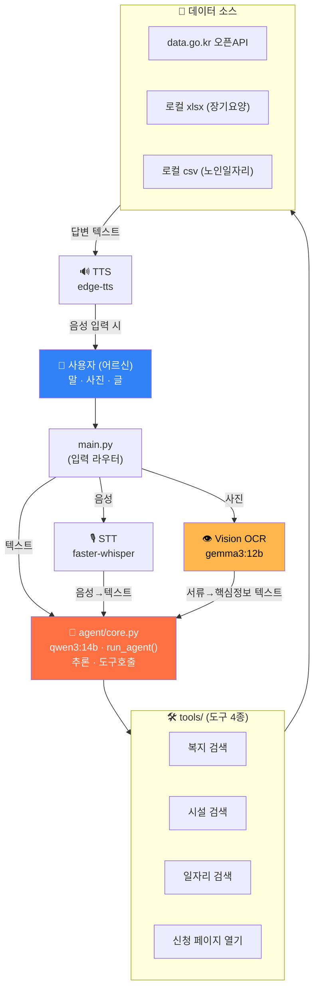

<div align="center">

# 🤝 마중 (Majung)

### AI가 먼저 나서서, 어르신의 권리를 찾아드립니다

디지털이 어려운 어르신이 **말·사진·글** 어떤 방식으로든 질문하면,<br/>
자신에게 맞는 **노인 복지 혜택을 찾아 쉬운 말로 안내하고 신청 페이지까지 열어주는**<br/>
**로컬 멀티모달 AI 에이전트**입니다.

<br/>


</div>

---

> **'마중'** = 누군가를 맞으러 나가는 것.
> 복지 사각지대에 계신 어르신을 시스템이 **먼저 마중 나간다**는 의미를 담았습니다.

<br/>

## 📌 왜 만들었나요 (문제 정의)

받을 수 있는 복지가 있어도 못 받는 어르신이 많습니다. 어르신은 다음 세 가지 장벽에 동시에 직면합니다.

| 장벽 | 설명 |
|------|------|
| 🧩 **정보 단절** | 기초연금·장기요양·맞춤돌봄·노인일자리 등 받을 수 있는 혜택이 있어도 **그 존재 자체를 모르고** 지나칩니다. |
| 💻 **디지털 장벽** | 복잡한 행정 용어, 어려운 웹사이트, 작은 글씨 → **타이핑·검색 자체가 막혀** 신청을 포기합니다. |
| 📄 **종이·행정 장벽** | 우편 안내문 해석부터 서류 작성까지, 복잡한 절차가 **높은 심리적 문턱**이 됩니다. |

**→ 해결:** 음성·이미지·텍스트를 모두 받는 **멀티모달** + 행정 용어를 **쉬운 말로 번역** + **실제 신청까지 연결**

<br/>

## ✨ 주요 기능

- 🎙️ **양방향 음성 대화** — 어르신의 일상 발화를 인식(STT)하고, 답변을 쉬운 말 음성(TTS)으로 들려드립니다.
- 📷 **서류 촬영 인식** — 우편 안내문·공고문을 사진으로 보여주면 핵심 정보(자격·기한·문의처)를 추출해 설명합니다.
- 🎯 **노인복지 맞춤 큐레이션** — 연령·거주지 등을 바탕으로 가장 적합한 혜택을 선제적으로 추천합니다.
- 🗣️ **행정 용어 쉬운 해석** — 딱딱한 공고문을 어르신 눈높이의 친근한 말로 풀어 설명합니다.
- 🔗 **신청까지 연결** — 단순 안내를 넘어 **신청 페이지를 직접 열어** 드립니다.

<br/>

## 🏗️ 시스템 아키텍처

사용자의 입력 종류(음성·사진·텍스트)에 따라 분기되고, **두뇌 모델**과 **눈(비전) 모델**을 엄격히 분리한 단방향 파이프라인으로 동작합니다.



### 설계 원칙

1. **두 모델 분리 원칙** — 두뇌(`qwen3:14b`)와 눈(`gemma3:12b`)을 **절대 섞지 않습니다.** 비전은 "이미지 → 텍스트"만, 두뇌는 "텍스트 → 추론·도구호출"만 담당하며, 비전 결과를 두뇌의 입력으로 넘기는 **단방향 파이프라인**입니다.
2. **로컬 우선 (Privacy)** — LLM은 전부 로컬 Ollama에서 구동되어 **어르신의 음성·서류가 외부로 나가지 않습니다.**
3. **Mock-first 개발** — `USE_MOCK` 토글로 가짜데이터↔실데이터를 전환하며, 반환 형식을 동일하게 유지해 실데이터 교체 시 충격을 최소화합니다.
4. **도구 개수 제한 (3~5개)** — 작은 로컬 모델의 혼동을 방지합니다. (현재 4종)
5. **실패해도 안 죽는 파이프라인** — 모든 도구·음성·비전이 `try/except`로 감싸져, 오류 시 사람이 읽을 수 있는 메시지를 반환합니다.

<br/>

## 🔄 동작 시나리오

<details>
<summary><b>시나리오 A — 텍스트로 복지 찾기</b></summary>

```
어르신: "파주 사는데 돌봄 서비스 있어요?"
   ↓ main.py (텍스트로 인식)
   ↓ qwen3:14b 가 search_welfare_services("경기도 파주시", "돌봄") 호출 판단
   ↓ data.go.kr API 조회 → 결과를 쉬운 말로 정리
마중: "노인맞춤돌봄서비스를 받으실 수 있어요. 만 65세 이상이고..."
   ↓ "신청 페이지를 열어 드릴까요?" → "응"
   ↓ 복지로 신청 페이지가 브라우저로 열림
```
</details>

<details>
<summary><b>시나리오 B — 사진(서류)으로 안내받기</b></summary>

```
어르신: "사진" 입력 → 파일 선택 창 → 안내문 사진 클릭
   ↓ gemma3:12b 가 [제도명·자격·기한·문의처] 추출 (이미지→텍스트)
   ↓ qwen3:14b 가 어르신 눈높이로 재설명
마중: "이건 기초연금 신청 안내문이에요. 만 65세 이상이면 신청할 수 있고,
       문의는 파주시청으로 하시면 돼요."
```
</details>

<details>
<summary><b>시나리오 C — 음성으로 대화</b></summary>

```
어르신: "녹음" 입력 → 10초 동안 말하기
   ↓ faster-whisper(small, CPU) 가 음성→한국어 텍스트
   ↓ run_agent() 로 답변 생성
   ↓ edge-tts 가 답변을 한국어 음성으로 재생 (마크다운 기호 제거 후 읽음)
마중(음성): "노인 일자리는 시니어클럽이나 주민센터에서 신청하실 수 있어요."
```
</details>

<br/>

## 🧰 기술 스택

| 구분 | 기술 | 선택 이유 |
|------|------|-----------|
| 🧠 두뇌 LLM | `qwen3:14b` (Ollama) | 한국어·도구호출 성능, 로컬 구동 가능 크기 |
| 👁️ 비전 LLM | `gemma3:12b` (Ollama) | 한국어 서류 OCR/이해, 로컬 멀티모달 |
| 🛠️ 도구호출 | ollama 파이썬 라이브러리 | 타입힌트+docstring으로 도구 스키마 자동 생성 |
| 🎙️ STT | faster-whisper (small, CPU/int8) | 로컬 구동, 한국어 인식, 가벼움 |
| 🔊 TTS | edge-tts (ko-KR-SunHiNeural) | 자연스러운 한국어 음성 |
| 📊 데이터 | data.go.kr 오픈API + xlsx/csv | 실제 공공 복지 데이터 |
| ⚙️ 런타임 | 로컬 Ollama (localhost:11434) | 개인정보 외부 미전송 |

<br/>

## 📁 프로젝트 구조

```
majung/
├── config.py          # 모델명·API엔드포인트·경로·음성상수 (USE_MOCK 토글)
├── main.py            # CLI 진입점 / 입력 종류(음성·사진·텍스트) 분기
├── agent/
│   ├── core.py        # run_agent() — 에이전트 루프(도구호출 반복)
│   └── prompts.py     # SYSTEM_PROMPT — 어르신 눈높이 6대 규칙
├── tools/
│   ├── welfare.py     # ① 복지검색 + 신청페이지 열기
│   ├── facility.py    # ② 장기요양시설 검색 (xlsx)
│   ├── jobs.py        # ③ 노인일자리 검색 (csv)
│   └── registry.py    # TOOLS/FUNCS 레지스트리
├── multimodal/
│   ├── vision.py      # 서류 OCR (gemma3:12b)
│   ├── stt.py         # 음성→텍스트 (faster-whisper)
│   └── tts.py         # 텍스트→음성 (edge-tts)
├── data/              # 실제 csv·xlsx + mock JSON
└── tests/             # 시나리오/음성/샘플문서 테스트
```

<br/>

## 🚀 설치 및 실행

> 아래는 일반적인 실행 절차 예시입니다. 실제 패키지명·진입점은 저장소 상황에 맞게 조정해 주세요.

### 1. 사전 준비 — Ollama 및 모델

```bash
# Ollama 설치 후 모델 내려받기
ollama pull qwen3:14b
ollama pull gemma3:12b

# Ollama 서버 실행 (localhost:11434)
ollama serve
```

### 2. 의존성 설치

```bash
git clone https://github.com/<your-id>/majung.git
cd majung

python -m venv .venv
# Windows
.venv\Scripts\activate
# macOS / Linux
# source .venv/bin/activate

pip install -r requirements.txt
```

### 3. 환경 변수 설정

```bash
# .env 파일에 data.go.kr API 키를 넣어 주세요 (시크릿은 절대 커밋하지 않습니다)
DATA_GO_KR_API_KEY=발급받은_키
```

### 4. 실행

```bash
python main.py
```

실행 후 안내에 따라 **텍스트 입력**, **`사진`(파일 선택)**, **`녹음`(10초 음성)** 중 원하는 방식으로 대화하시면 됩니다.

<br/>

## 💡 시스템 프롬프트 6대 규칙 (어르신 눈높이)

1. 항상 쉽고 친근한 **존댓말**, 짧은 문장
2. '소득인정액' 같은 **행정 용어는 반드시 풀어서** 설명
3. 받을 수 있는 복지를 먼저 알려주고 신청법을 **1·2·3 순서로** 안내
4. 정보 부족 시 **반드시 도구로 확인**, 모르면 추측하지 않음
5. 한 번에 많이 쏟지 않고 **가장 중요한 것부터**
6. 안내 후 **"신청 페이지를 열어 드릴까요?"** — 단, 본인인증·제출은 어르신이 직접

<br/>

## ✅ 차별점

- **진짜 멀티모달** — 말·사진·글 3가지 입력을 모두 처리합니다. (대부분의 서비스는 텍스트만 지원)
- **로컬 구동** — 어르신의 음성·서류가 외부 서버로 나가지 않습니다.
- **실제 공공데이터** — data.go.kr 복지 API + 장기요양/일자리 실데이터를 사용합니다.
- **신청까지 연결** — 단순 안내를 넘어 신청 페이지를 직접 열어 드립니다.
- **어르신 중심 UX** — 쉬운 말 번역, 파일 클릭 선택, 10초 넉넉한 녹음, 깔끔한 음성.

<br/>

## 🧭 한계 및 향후 계획

- 본인인증·실제 제출은 법적 책임·개인정보 문제로 **어르신이 직접** 진행합니다. (자동 제출 미구현)
- TTS(edge-tts)는 **온라인이 필요**합니다. (오프라인 필요 시 pyttsx3 등으로 교체 가능)
- 시설 API는 지역검색을 지원하지 않아 xlsx 파일을 우선 조회합니다. (best-effort)
- **향후:** 신청 폼 자동 채움 보조, 더 많은 복지 데이터 연동, 장애인 등 다른 디지털 취약계층으로 확장.

<br/>

---

<div align="center">

### 👤 만든 사람

**오현근** · 2022152024

> AI가 먼저 나서서, 어르신의 권리를 찾아드립니다. 🤝

</div>
